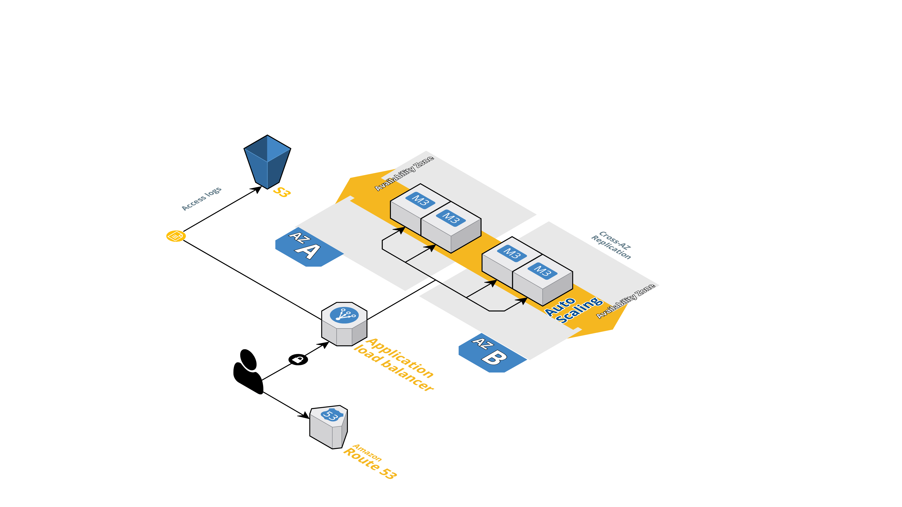

<p style="float: left; clear: left">

</p>


This repo contains a Module for how to deploy a
[Vault](https://www.vaultproject.io/) cluster on [AWS](https://aws.amazon.com/)
using [Terraform](https://www.terraform.io/). 


Vault is an open source tool for managing secrets.
By default, this Module uses [Consul](https://www.consul.io) as a [storage
backend](https://www.vaultproject.io/docs/configuration/storage/index.html). 


## What's a Module?

A Module is a canonical, reusable, best-practices definition for how to run a single piece of infrastructure, such 
as a database or server cluster. Each Module is created primarily using [Terraform](https://www.terraform.io/), 
includes automated tests, examples, and documentation, and is maintained both by the open source community and 
companies that provide commercial support. 

Instead of having to figure out the details of how to run a piece of infrastructure from scratch, you can reuse 
existing code that has been proven in production. And instead of maintaining all that infrastructure code yourself, 
you can leverage the work of the Module community and maintainers, and pick up infrastructure improvements through
a version number bump.

<p align="center">
  
</p>

 
## How do you use this Module?

1. Create an AMI that has Vault and Consul installed

   We achieve segregration trough SELinux and systemd
   If you are just experimenting with this Module, you may find it more convenient to use one of our 	official public AMIs:
   - [Latest Ubuntu 16 AMIs]().
   - [Latest Centos Linux AMIs]().
   
   **WARNING! Do NOT use these AMIs in your production setup.<br>
  	In production, you should build your own AMIs in your 
     own AWS account.**

1. Deploy that AMI across an Auto Scaling Group in a private subnet using the Terraform. 

# Security

1. AMI with CIS
2. WAF
3. Access Logs
4. Server side encrypted bucket
5. Encrypted storage

### Port Used

Consul requires up to 6 different ports to work properly, some on TCP, UDP, or both protocols. Below we document the requirements for each port.
    
    - HTTP API (Default 8500). This is used by clients to talk to the HTTP API. *Localhost* TCP only
    - Server RPC (Default 8300). This is used by servers to handle incoming requests from other agents. TCP only.
    - Serf LAN (Default 8301). This is used to handle gossip in the LAN. Required by all agents. TCP and UDP.
    - Serf WAN (Default 8302). This is used by servers to gossip over the WAN, to other servers. TCP and UDP. 
    - As of Consul 0.8 the WAN join flooding feature requires the Serf WAN port (TCP/UDP) to be listening on both WAN and LAN interfaces. 

Vault doesn't need as many ports to work as is just acting as a frontend

    - HTTP API (Default 8200, we use 80). This is used by clients to talk to the
    HTTP API

### ALBs

The alb is setup with restriction on outbound and inbound traffic. You might
want to check those.

## SSL Certificates

There are 2 types of certificates generated, one is the main responsabile to
handle the traffic to the ALB, \
the other sets is for internal cluster communication and for CLI tools. \

We generate them at run time, leveraging ACM and cfssl.

ACM certificates are stored within AWS while the internal certificates are
stored on an S3 bucket using SSE and granular IAM roles.


## Cgroup isolation

We achieve some isolation using cgroup, leveraging some features of systemd

- Restict services to user
```
User=vault
Group=vault
```

- Don't mess with /dev
```
PrivateDevices=yes
```

- Private tmp
```
PrivateTmp=yes
```

- Read only file system /usr /var /etc
```
ProtectSystem=full
```

- Home read only
```
ProtectHome=read-only
```

## VPC Endpoint


## Disaster recovery

## How do I contribute to this Module?

Contributions are very welcome! Check out the [Contribution Guidelines]() for instructions.

## How is this Module versioned?

This Module follows the principles of [Semantic Versioning](http://semver.org/). You can find each new release, 
along with the changelog, in the [Releases Page](../../releases). 

During initial development, the major version will be 0 (e.g., `0.x.y`), which indicates the code does not yet have a 
stable API. Once we hit `1.0.0`, we will make every effort to maintain a backwards compatible API and use the MAJOR, 
MINOR, and PATCH versions on each release to indicate any incompatibilities. 

## License

MIT
	